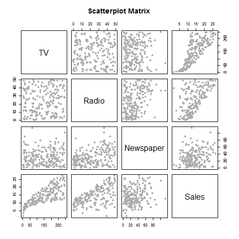

#Abstract
This paper reproduces Section 3.2 of _Introduction to Statistical Learning_ by Hastie, Tibshirani, James, and Witten. This section discusses the Multiple Linear Regression model and fits one to the _Advertising_ dataset. The model uses data on television, newspaper, and radio advertising to predict units of sales.

#Introduction
We return to the _Advertising_ dataset, where we want to build a model from data on three advertising media to predict Sales. A past paper discusses the Simple Linear Regression model; so, one solution is fit three Simple Linear Regression models - one for each predictor. However, this is not the only option - we can simply tweak the linear model to allow for more predictors, using a __Multiple Linear Regression Model__. 

A Multiple Linear Regression model extends the Simple Linear Regression model to accomodate more predictors for a single response variable. Recall the Linear Regression model we have previously encountered:

$$Y = \beta_0 + \beta_1X + \epsilon$$,

where $Y$ is our response variable, $X$ is our predictor, $\epsilon$ is random noise, and the beta coefficients are the intercept and slope of our linear model, respectively.

The Multiple Linear Regression model is:

$$Y = \beta_0 + \beta_1X_1 + \beta_2X_2 + ... + \beta_nX_n + \epsilon$$,

where $X_j$ represents the $jth$ predictor and $\beta_j$ quantifies the association between that variable and the response.


#Data
Before fitting any model it is imperative that we discuss our data. The _Advertising_ dataset consists of _Sales_ (in thousands of units) of a particular product in 200 different markets, along with advertising budgets (in thousands of dollars) for the product in each of those markets for three different media: _TV_, _Radio_, and _Newspaper_.


Below is the first five rows of the Advertising Dataset:  
```{r dataset, echo=F, fig.align='center'}
envpath <- "C:/Users/Nura/Desktop/stat159-fall2016-hw03/report/"
setwd(envpath)
source("../code/scripts/regression-script.R")
head(advertising, 5)
```

It is also a good idea to look at some data visualizatoins:

{width=300px} {width=300px}

Finally, because we are using multiple predictors, it is important to see their level of correlation. Predictors that are too highly correlated may cause problems in making predictions, as one predictor can be easily interchanged with another.

__Figure 2__ Correlation matrix for TV, radio, newspaper, and sales for the _Advertising_ dataset.

```{r correlation matrix output xtable, results="asis", message=F, warning=F, echo=F}
library(xtable)
cor_table <- xtable(cor(advertising))
#                          caption = "Multiple Linear Regression of Sales onto Radio, TV, and Newspaper")
print(cor_table, type="latex", comment = F)
```


#Methodology
We discuss how to specifically fit a multiple linear regression model and compare the outcome to those of three simple linear models.

##Fitting Simple Linear Regression Models

We use the methodology discussed in the paper _Simple Linear Regression_ by Nura Kawa (reproduced from Section 3.1 of _Introduction to Statistical Learning_) to fit a simple linear model for each predictor with Sales. The results are as follows:

__Figure 1__ Simple Regression Models for the _Advertising_ dataset. The three tables below show coefficients of the linear regression models of Sales regressed onto Radio, Newspaper, and TV, respectively.

```{r regression output xtable, results="asis", message=F, warning=F, echo=F}

#advertising <- read.csv("../data/Advertising.csv")[,-1]
library(xtable)
radio_reg_table <- xtable(lm(Sales~Radio, data = advertising),
                          caption = "Simple Regression of Sales on Radio")
print(radio_reg_table, type="latex", comment = F)
cat("\n\n")
newspaper_reg_table <- xtable(lm(Sales~Newspaper, data = advertising),
                              caption = "Simple Regression of Sales on Newspaper")
print(newspaper_reg_table, type="latex", comment = F)

cat("\n\n")
tv_reg_table <- xtable(lm(Sales~TV, data = advertising),
                              caption = "Simple Regression of Sales on TV")
print(tv_reg_table, type="latex", comment = F)

```

This solution to our question of prediction leaves much to be desired, as it becomes difficult to make one estimate using three completely different linear models. Furthermore, each model leaves out a possible influence from a separate predictor. Thus, we will fit a Multiple Linear Regression Model.

##Fitting a Multiple Linear Regression Model

Specifically, our Multiple Linear Regression model is the following:

$$\textbf{sales} = \beta_0 + \beta_1\textbf{TV} + \beta_2\textbf{radio} + \beta_3\textbf{newspaper} + \epsilon$$.  

As with simple linear models, we first test hypotheses, namely:


##Hypothesis Testing
Our _null hypothesis_ $H_0$ is: $H_0$: $\beta_1 = \beta_2 = ... = \beta_p = 0$  

Our _alternative hypothesis_ $H_a$ is: $H_a$: at least one $\beta_j$ is non-zero

Simply put, we assume the null hypothesis of each predictor having no influence on Sales, and test to see if at least one predictor has an association with Sales. We set our p-value to be 0.05, meaning that anything below this would allow us to reject our null hypothesis.


##Computing Coefficients
As with a simple linear model, we will compute the following coefficients as follows:  

__Residual Sum of Squares (RSS)__  
Residuals are the difference between the observed value of the dependent variable _y_ and the predicted value, $\hat(y)$. The Residual Sum of Squares is simply the summation of all residuals, squared:

$$RSS = \sum(y_1 - \hat{y_i})^2$$

__Total Sum of Squares (TSS)__  
The total sum of squares explains the variability already present in the dataset: it is the sum of the difference between each value of _y_ (Sales, in our case) and its mean, squared:

$$TSS = \sum(y_1 - \bar{y})^2$$

__R-Squared__  
The $R^2$ measures the goodness of fit of our model. It measures the proportion of variance explained by our model. Thus it has the range [0,1] and is independent of Y's scale.

$$ R^2 = \frac{(TSS - RSS)}{TSS} $$

__Residual Standard Error__  
The RSE is an estimate of the standard deviation of the error in our model. This shows how far our data will deviate from the generated regression line.

$$RSE = \sqrt{\frac{1}{n-2}\sum{(y_i - \hat{y_i})^2}}$$

__F-Statistic__  
This is our test statistic: Allowing _p_ to be the number of predictors and _n_ to be the number of observations, we have:  

$$F = \frac{(TSS - RSS)/p}{RSS/(n-p-1)}$$ 

##Model Selection
Now that we have discussed how to fit the model, we also need to pay attention to model selection. In cases where we have many predictors, using all predictors may not always be ideal. Our goal of a good model is to __minimize our p-value__ and to __minimize RSS__. The following three methods allow us to select a model that approaches our goals.  

###Forward selection
We begin with a model that has only intercept terms. We iteratively fit all _p_ (where _p_ is number of predictors) possible Simple Linear Regression models, measure our RSS, and then add the variable that minimizes the RSS, until we reach our stopping point. 

###Backward selection
This is the same as Forward Selection, but we begin with _all_ predictors and iteratively remove the predictors that yield the largest p-value.

###Mixed selection
This method combines the previous two. We first forward select, then, if the p-value becomes too large due to the addition of one variable, we remove that variable from our model. This iterative method has the goal of dually minimizing RSS and the p-value. This may not result in the optimum of either, but allows one to balance out the negatives of both forward and backward selection.

To assess __model accuracy__, we can also look at the $R^2$ and the RSE coefficients, which are explained previously.


#Results

We fit a Multiple Linear Regression model on the _Advertising_ data, using TV, Radio, and Newspaper to predict Sales. The results are shown below:

__Figure 3__ Multiple Linear Regression Coefficients__

```{r multiple regression output xtable, results="asis", message=F, warning=F, echo=F}
multiple_reg_table <- xtable(lm(Sales~., data = advertising),
                          caption = "Multiple Linear Regression of Sales onto Radio, TV, and Newspaper")
print(multiple_reg_table, type="latex", comment = F)
```


__Figure 4__ More information about the least squares model for the regression of number of units sold on TV, newspaper, and radio advertising budgets in the _Advertising_ dataset.

```{r, echo=F}
# lm() and summary() objects
reg <- lm(Sales~., data = advertising)
regsum <- summary(reg)

#--------------------------------------------------------------------------------------------------------
# RSS

residual_sum_squares <- function(lm_object)
{
  # this function takes in an lm() object and outputs the RSS.
  
  res <- lm_object$model[,1] - lm_object$fitted.values
  sum(res^2)
}

#residual_sum_squares(reg)

#--------------------------------------------------------------------------------------------------------
# TSS

total_sum_squares <- function(lm_object)
{
  # this function takes in an lm() object and outputs the TSS

  sales_mean <- mean(lm_object$model[,1])
  sales_vals <- lm_object$model[,1]
  sum((sales_vals-sales_mean)^2)
}

#total_sum_squares(reg)

#--------------------------------------------------------------------------------------------------------
# RSE

residual_std_error <- function(lm_object)
{
  # this function takes in an lm() object and outputs the RSE
  n = length(lm_object$residuals)
  RSS = residual_sum_squares(lm_object)
  sqrt((1/(n-2))*RSS)
}

#residual_std_error(reg)

#--------------------------------------------------------------------------------------------------------
# R^2

r_squared <- function(lm_object)
{
  # this function takes in an lm() object and outputs the R^2
  TSS = total_sum_squares(lm_object)
  RSS = residual_sum_squares(lm_object)
  (TSS-RSS)/TSS
}

#r_squared(reg)


#--------------------------------------------------------------------------------------------------------
# F-Stat

f_statistic <- function(lm_object)
{
  # this function takes in an lm() object and outputs the F-statistic
  p = ncol(lm_object$model)-1 #number of predictors
  n = nrow(lm_object$model)
  RSS = residual_sum_squares(lm_object)
  TSS = total_sum_squares(lm_object)
  numerator <- (TSS-RSS)/p
  denominator <- RSS/(n-p-1)
  numerator/denominator
}
```


```{r multiple lin reg model output xtable, results="asis", message=F, warning=F, echo=F}
op_table <- data.frame("Quantity" = c("Residual Standard Error",
                          "R-Squared",
                          "F-Statistic"),
           "Value" = c(residual_std_error(reg),
                       r_squared(reg),
                       f_statistic(reg)))

op_table <- xtable(op_table, caption = "Multiple Linear Regression Coefficients")
print(op_table, type = "latex", comment = F, include.rownames=F, include.colnames = T)
```


##Checking Model Assumptions

The Multiple Linear Regression Model assumes __independent predictors__, __normally distributed variables__, and __constant variance__.


The images below are part of an evaluation of our Model. The __QQ-Plot__ checks the assumption of normality. We see that our valus are indeed normally distributed, as they fit the theoretical quantiles.   The _residuals_, or the difference between the actual values of _y_ and our predicted values, $\hat{y}$, are interesting to look at. Namely, __it is important that we check whether there exists a non-linear relationship in our data__. We look at the _heteroschedasticity_ of our residuals - whether or not they display a pattern. 

{width=300px} {width=300px}


Our residuls show a non-linear (nearly quadratic) pattern by the curve of the red line, meaning that perhaps a different model could better explain the data. 

##Checking our Model Fit

Like in Simple Linear Regression, we look at the $R^2$. Our value of 0.9 is very good and indicates a much better-fitting model than the Simple Linear Model with TV used in a previous paper. To interpret an __F-Statistic__ we look at its size - since this is a ratio, we hope for a value larger than 1. We have 570.27) reveals that this model is useful because a relationship definitely exists between our dependent and independent variables. Our __RSE__ is not too large to discredit the model, meaning that it is a good fit.  

Now we look at __p-values__. Ourp-values are very low for all predictors but Newspaper, meaning that we could leave out Newspaper and perhaps get a better fit. Thus we can __reject the null hypothesis__: at least one predictor has an association with our response, Sales. 

#Conclusion
We fit a Multiple Linear Regression model and found that for all predictors but Newspaper very small p-values, allowing us to reject our null hypothesis: at least one predictor has a positive association. Specfically, TV and Radio have positive association with Sales. However, this model is not perfect; we see that our residuals are heteroschedastic, meaning that variance of the residuals is not constant. There appears to be an underlying non-linear relationship in our Sales predictor that cannot be explained by a linear model. Thus, while we have progressed in fitting a model to our _Advertising_ dataset, we must continue trying different methods to get an optimal prediction.
